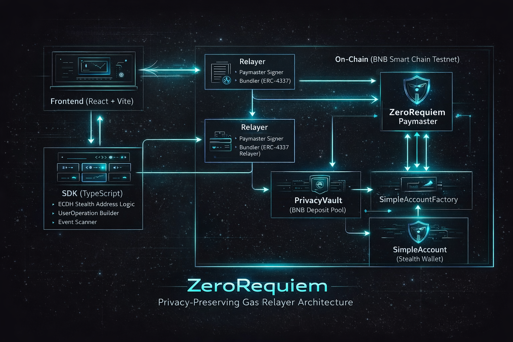
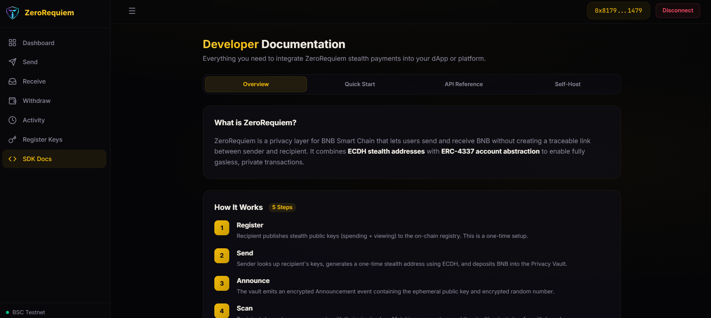

<p align="center">
  
</p>

<h1 align="center">ZeroRequiem</h1>

<p align="center">
  <strong>Privacy-preserving BNB transfers with gasless withdrawals on BNB Smart Chain</strong>
</p>

<p align="center">
  <a href="https://zerorequiem.vercel.app"></a>
  
  
  
</p>

---

ZeroRequiem lets users send and receive BNB without creating a traceable on-chain link between sender and recipient. It combines **ECDH stealth addresses** with **ERC-4337 account abstraction** so that stealth wallets never need to receive gas from a known source.

---

## Architecture & Workflow

<p align="center">
  
</p>

**How It Works:**

1. **Register** — Recipient publishes stealth public keys to an on-chain registry (one-time)
2. **Send** — Sender deposits BNB into a shared vault targeting a one-time stealth address derived via ECDH
3. **Scan** — Recipient decrypts on-chain announcements with their viewing key to discover payments
4. **Withdraw** — Recipient submits an ERC-4337 UserOp; the Paymaster sponsors gas so the stealth wallet stays anonymous
5. **Receive** — BNB arrives in the recipient's wallet with zero on-chain link to the sender

---

## Screenshots

<p align="center">
  <br/>
  <em>Dashboard — wallet status, stealth key registration, relayer health, quick actions</em>
</p>

<p align="center">
  <br/>
  <em>Developer Documentation — tabbed SDK docs with code examples, API reference, and self-host guide</em>
</p>

---

## Documentation

| Document | Contents |
|----------|----------|
| [`docs/PROJECT.md`](./docs/PROJECT.md) | Problem statement, solution, ecosystem impact, roadmap |
| [`docs/TECHNICAL.md`](./docs/TECHNICAL.md) | Architecture diagrams, setup instructions, demo guide |
| [`bsc.address`](./bsc.address) | All deployed contract addresses with BSCScan links |
| [`sdk/README.md`](./sdk/README.md) | SDK installation, API reference, integration examples |
| [`docs/EXTRAS.md`](./docs/EXTRAS.md) | Demo video and presentation links |

---

## Quick Start

```bash
cp .env.example .env              # Add deployer + relayer private keys

cd contracts && npm install
npx hardhat compile
npx hardhat run scripts/deploy.ts --network bscTestnet   # Deploy & copy addresses to .env

cd ../relayer && npm install
npx ts-node src/index.ts          # Start relayer on port 3001

cd ../frontend && npm install
npm run dev                       # Open http://localhost:5173
```

See [`docs/TECHNICAL.md`](./docs/TECHNICAL.md) for full setup and demo walkthrough.

---

## SDK

Add private stealth payments to any dApp:

```bash
npm install zerorequiem-sdk
```

```typescript
import { ZeroRequiem } from "zerorequiem-sdk";

const zr = new ZeroRequiem({ rpcUrl, chainId, vaultAddress, registryAddress,
  factoryAddress, entryPointAddress, paymasterAddress, relayerUrl });

await zr.registerKeys(signer, keys);                     // one-time setup
await zr.send(signer, recipientAddress, "0.01");          // send privately
const payments = await zr.scan(spendKey, viewKey);        // find payments
await zr.withdraw(stealthPrivKey, myWallet, "0.01");      // gasless withdraw
```

---

## Project Structure

```
ZeroRequiem/
├── contracts/          Solidity: PrivacyVault, Paymaster, Registry, SimpleAccount
├── sdk/                TypeScript SDK: stealth addresses, ECDH, ERC-4337 UserOps
├── relayer/            Express.js: Paymaster signer + ERC-4337 bundler
├── frontend/           React dashboard: send, receive, withdraw, activity
├── docs/               Project & technical documentation
├── assets/             Screenshots and logo
└── bsc.address         Deployed contract addresses (JSON)
```

---

## Deployed Contracts (BSC Testnet)

| Contract | Address |
|----------|---------|
| PrivacyVault | [`0xc02cE66D57b7dC05446c041864aCdCc23B94Ad48`](https://testnet.bscscan.com/address/0xc02cE66D57b7dC05446c041864aCdCc23B94Ad48) |
| StealthKeyRegistry | [`0x867E1c09B0aa3C79A171de8d20CA0C14Dd21fcAb`](https://testnet.bscscan.com/address/0x867E1c09B0aa3C79A171de8d20CA0C14Dd21fcAb) |
| SimpleAccountFactory | [`0xaB885C2db018E3690269a91c9bDbdf53a5DC0614`](https://testnet.bscscan.com/address/0xaB885C2db018E3690269a91c9bDbdf53a5DC0614) |
| ZeroRequiemPaymaster | [`0xe0fdDfa9f06c9E35eCDec67f2c7AFCB3Af0E439C`](https://testnet.bscscan.com/address/0xe0fdDfa9f06c9E35eCDec67f2c7AFCB3Af0E439C) |
| EntryPoint v0.6 | [`0x5FF137D4b0FDCD49DcA30c7CF57E578a026d2789`](https://testnet.bscscan.com/address/0x5FF137D4b0FDCD49DcA30c7CF57E578a026d2789) |

---

## Tech Stack

<table>
<tr>
<td align="center"><strong>Smart Contracts</strong></td>
<td align="center"><strong>Backend</strong></td>
<td align="center"><strong>Frontend</strong></td>
<td align="center"><strong>Cryptography</strong></td>
</tr>
<tr>
<td align="center">
<br/>
<br/>

</td>
<td align="center">
<br/>
<br/>

</td>
<td align="center">
<br/>
<br/>

</td>
<td align="center">
<br/>
<br/>

</td>
</tr>
</table>
