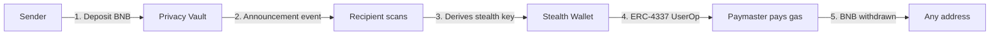

# ZeroRequiem: Problem, Solution & Impact

## 1. Problem

**On-chain transactions are fully transparent.** Every BNB transfer is permanently recorded on the blockchain, linking the sender's address to the recipient's address. This creates two privacy issues:

- **Sender-recipient linking**: Anyone can trace who paid whom by scanning the blockchain.
- **Gas funding deanonymization**: When a user creates a fresh wallet for privacy, they need BNB for gas. Funding that wallet from a known source (exchange, main wallet) immediately creates a traceable link back to their identity.

**Who is affected:**

- Users who want financial privacy on BNB Smart Chain
- dApp developers who need to protect user payment data
- DAOs and organizations that want to make confidential treasury payments

**Why it matters:** Financial privacy is a fundamental right. Without it, on-chain users face targeted phishing, social engineering, and unwanted surveillance. As BNB Chain adoption grows, the need for practical privacy tooling becomes critical.

---

## 2. Solution

ZeroRequiem is a **privacy layer for BNB Smart Chain** that breaks the on-chain link between sender and recipient using two core technologies:

### ECDH Stealth Addresses

Each recipient registers a pair of public keys (spending + viewing) on-chain. When someone sends them BNB, the protocol generates a **one-time stealth address** that only the recipient can compute the private key for. The BNB goes into a shared Privacy Vault, and an encrypted announcement is emitted on-chain.

### ERC-4337 Gas Abstraction

The stealth address has funds in the vault but zero gas. Normally, funding it with gas would break privacy. ZeroRequiem uses an ERC-4337 **Verifying Paymaster** to sponsor gas for the withdrawal transaction. The stealth wallet never needs to receive BNB from any known source.

### Key Features

- **Stealth addresses** -- Cryptographically derived one-time addresses using secp256k1 ECDH
- **Privacy Vault** -- Shared deposit pool that breaks sender-recipient linkage
- **Gasless withdrawals** -- ERC-4337 Paymaster sponsors gas so stealth wallets stay anonymous
- **Public SDK** -- TypeScript library for third-party integrations
- **Dashboard UI** -- Full-featured React frontend with wallet management, scanning, and activity history

### How It Differs from Alternatives

| Feature | ZeroRequiem | Basic mixer | Simple relay |
|---------|------------|-------------|--------------|
| Stealth addresses | Yes (ECDH) | No | No |
| Gas abstraction | ERC-4337 | No | Sometimes |
| No trusted setup | Yes | Depends | Yes |
| Public SDK | Yes | No | No |
| BNB native | Yes | Often EVM forks | Varies |

---

## 3. Business & Ecosystem Impact

**Target users:**

- Privacy-conscious BNB Chain users
- dApp developers integrating private payments
- DAOs making confidential payments
- Payroll and grant distribution platforms

**Value to the ecosystem:**

- Brings practical privacy tooling to BNB Chain (currently underserved)
- The public SDK enables any dApp to integrate stealth payments without building crypto from scratch
- Demonstrates that ERC-4337 account abstraction works on BSC for real-world privacy use cases

**Sustainability:**

- The relayer can charge a small fee per sponsored transaction
- SDK adoption creates network effects -- more registered users means more privacy for everyone

---

## 4. Limitations & Future Work

### Current Limitations

- **Testnet only** -- Deployed on BSC Testnet; mainnet deployment requires security audit
- **BNB only** -- Currently supports native BNB; BEP-20 token support is not implemented yet
- **Single relayer** -- The relayer is a centralized service; it cannot steal funds but can censor transactions
- **No ZKP** -- Uses ECDH stealth addresses (not zero-knowledge proofs); the Privacy Vault's anonymity set is limited to the number of depositors

### Short-term Roadmap

- BEP-20 token support (USDT, BUSD, etc.)
- Multiple relayer support for censorship resistance
- Mobile wallet integration
- Subgraph indexer for faster event scanning

### Long-term Roadmap

- Zero-knowledge proof integration for stronger privacy guarantees
- Cross-chain stealth payments (BSC <-> opBNB)
- Decentralized relayer network with staking
- Privacy-preserving compliance tools (selective disclosure)
