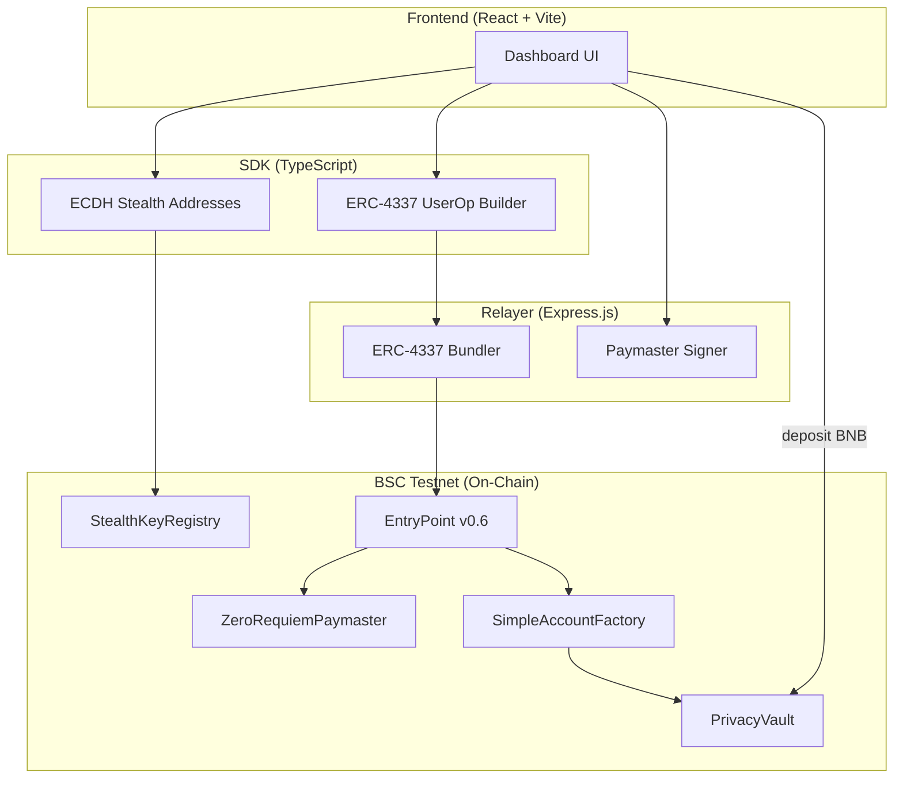
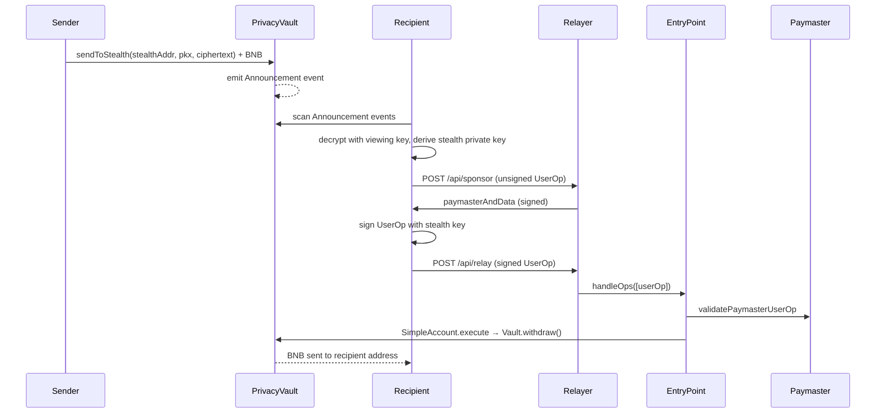
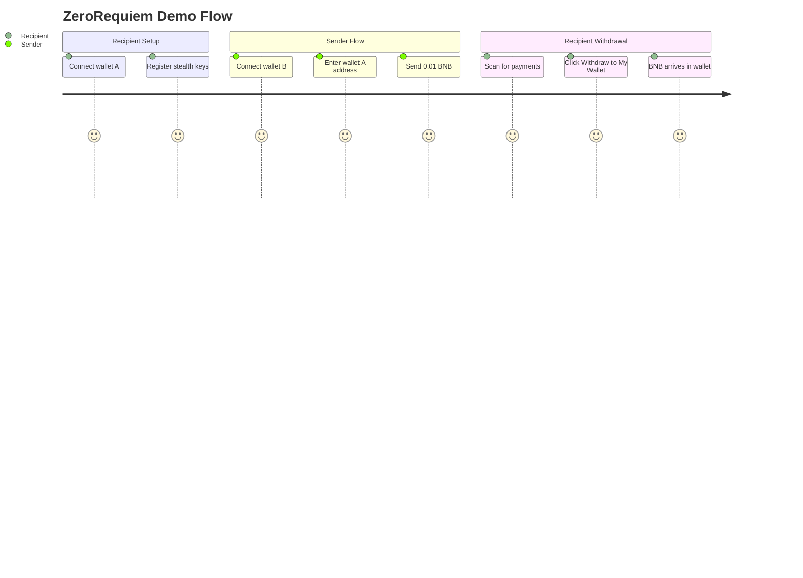

# Technical: Architecture, Setup & Demo

## 1. Architecture

### System Overview

ZeroRequiem is a four-component system: smart contracts (on-chain), a TypeScript SDK, an Express.js relayer, and a React frontend.



### Components

| Component | Tech | Purpose |
|-----------|------|---------|
| `contracts/` | Solidity 0.8.23, Hardhat | PrivacyVault, Paymaster, StealthKeyRegistry, SimpleAccount + Factory |
| `sdk/` | TypeScript, @noble/secp256k1 | ECDH key derivation, stealth address generation, UserOp building |
| `relayer/` | Express.js, ethers.js v6 | Paymaster signature service + ERC-4337 bundler |
| `frontend/` | React 19, Vite 7, TailwindCSS v4 | Dashboard with wallet connection, send, receive, withdraw, activity |

### Data Flow



### On-Chain vs Off-Chain

| On-Chain | Off-Chain |
|----------|-----------|
| PrivacyVault (deposit pool + withdrawal) | Relayer (paymaster signer + bundler) |
| StealthKeyRegistry (public key storage) | SDK (ECDH crypto, key derivation) |
| ZeroRequiemPaymaster (gas sponsorship) | Frontend (UI, wallet interaction) |
| SimpleAccount + Factory (ERC-4337 wallets) | Event scanning + decryption |
| EntryPoint v0.6 (UserOp execution) | |

### Security

- **Relayer cannot steal funds**: Only the stealth private key holder can authorize withdrawals via UserOp signature
- **Paymaster validation**: The Paymaster only sponsors operations signed by the relayer's known address, with time-windowed validity
- **No trusted setup**: All cryptography uses standard secp256k1 ECDH -- no MPC, no trusted ceremony
- **Replay protection**: The Paymaster uses nonce tracking and the EntryPoint enforces per-account nonces
- **Key derivation**: Stealth keys are deterministically derived from a wallet signature -- same wallet always produces the same keys

---

## 2. Setup & Run

### Prerequisites

- Node.js 18+ and npm
- MetaMask browser extension
- Two wallets funded with BSC testnet BNB (~0.2 tBNB each)
- Get tBNB: https://www.bnbchain.org/en/testnet-faucet

### Environment

```bash
cp .env.example .env
```

Fill in `.env`:

```
DEPLOYER_PRIVATE_KEY=0x...    # Wallet with tBNB for contract deployment
RELAYER_PRIVATE_KEY=0x...     # Separate wallet with tBNB for gas sponsorship
RELAYER_ADDRESS=0x...         # Public address of the relayer wallet
RPC_URL=https://bsc-testnet-dataseed.bnbchain.org
ENTRY_POINT_ADDRESS=0x5FF137D4b0FDCD49DcA30c7CF57E578a026d2789
RELAYER_PORT=3001
```

### Install & Build

```bash
# Install all dependencies
cd contracts && npm install && cd ..
cd sdk && npm install && cd ..
cd relayer && npm install && cd ..
cd frontend && npm install && cd ..
```

### Deploy Contracts

```bash
cd contracts
npx hardhat compile
npx hardhat run scripts/deploy.ts --network bscTestnet
```

The script outputs contract addresses. Copy them into `.env`:

```
VAULT_ADDRESS=0x...
REGISTRY_ADDRESS=0x...
FACTORY_ADDRESS=0x...
PAYMASTER_ADDRESS=0x...
```

The deploy script also deposits 0.05 tBNB into the Paymaster's EntryPoint stake.

### Run

Start the relayer first (it must be running for the frontend to load contract config):

```bash
cd relayer
npx ts-node src/index.ts
# Output: ZeroRequiem Relayer running on port 3001
```

Then start the frontend:

```bash
cd frontend
npm run dev
# Output: http://localhost:5173
```

### Verify

1. The relayer console should show contract addresses on startup
2. Open `http://localhost:5173` -- the dashboard should load
3. Connect MetaMask -- it should auto-switch to BSC Testnet (chain ID 97)
4. The Dashboard should show wallet balance, relayer status "Online", and Paymaster deposit

---

## 3. Demo Guide

### Access

Run both the relayer and frontend locally as described above. Open `http://localhost:5173` in your browser.

### User Flow



### Step-by-Step

**Recipient (Wallet A):**

1. Open the app in Chrome Profile A, connect MetaMask with Wallet A
2. Go to **Register Keys** in the sidebar
3. Click **Generate Stealth Keys** -- sign the MetaMask message
4. Click **Register Keys** -- confirm the on-chain transaction
5. Wait for tx confirmation

**Sender (Wallet B):**

1. Open the app in Chrome Profile B, connect MetaMask with Wallet B
2. Go to **Send** in the sidebar
3. Enter Wallet A's address (the recipient's normal MetaMask address)
4. Enter amount (e.g. 0.01 BNB)
5. Click **Send Privately** -- confirm the MetaMask transaction
6. The app shows the stealth account address and BSCScan link

**Recipient withdraws (Wallet A):**

1. Go to **Receive** in the sidebar
2. Click **Scan for Payments**
3. The app finds the incoming payment with the amount
4. Click **Withdraw to My Wallet** on the payment card
5. Watch the progress: Build → Sponsor → Sign → Relay → Done
6. BNB arrives at Wallet A's address (check on BSCScan)

### Expected Outcomes

| Step | What you should see |
|------|-------------------|
| Register Keys | Two public keys displayed, then "Registered" badge with BSCScan link |
| Send | Transaction hash and stealth account address displayed |
| Scan | Payment card showing amount, block number, and BSCScan link |
| Withdraw | Progress bar through 5 steps, then "Withdrawn" success with BSCScan link |
| Dashboard | Updated balance, relayer "Online", recent activity entries |

### Troubleshooting

| Issue | Fix |
|-------|-----|
| "Recipient has not registered stealth keys" | The recipient must complete Register Keys before anyone can send to them |
| "insufficient funds for gas" on relayer | The relayer wallet needs more tBNB from the faucet |
| Scan shows no payments | Make sure the relayer is running; try scanning again after a few seconds |
| MetaMask not connecting | Manually add BSC Testnet in MetaMask (Chain ID: 97, RPC: `https://bsc-testnet-dataseed.bnbchain.org`) |
| Dashboard shows relayer "Offline" | Start the relayer with `cd relayer && npx ts-node src/index.ts` |
